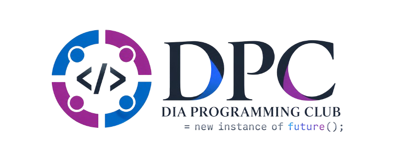

<div align="center">
  
  <h1>DIA Programming Club (DPC)</h1>
  <p><code>= new instance of future();</code></p>
  <p>The official home of the DIA Programming Club at Daffodil International Academy, Dhaka.<br/>
  Includes the AWS Student Builder Group at DIA wing.</p>
  
  🌐 **[diapc.dev](https://diapc.dev)** · 📍 Daffodil International Academy, Dhaka
</div>

---

## 🌟 Vision

A club website that feels like something built by programmers, not a template. It's animated, interactive, fast on mobile, and fun to explore. We want students to open it and think, *"I want to be part of this."*

## 🛠️ Tech Stack

We use a modern and highly optimized stack to ensure the best developer and user experience:

| Layer | Choice |
|---|---|
| **Framework** | Next.js (App Router) + TypeScript |
| **Styling** | Tailwind CSS v4 + CSS variables for themes |
| **Animation** | Motion (Framer Motion), GSAP + ScrollTrigger |
| **Smooth Scroll**| Lenis |
| **Hosting** | Vercel |
| **Package Mgr** | pnpm |

## ✨ Signature Features

- 🖱️ **Custom Cursor:** Dot + spring-following ring, magnetic buttons, and code-glyph trails.
- 🎨 **Theme-based Backgrounds:** Each theme features its own animated background, going beyond a simple color swap.
- 🔦 **Spotlight Cards:** A glow follows the pointer across card borders.
- ⌨️ **Hero Typing Sequence:** Dynamically ends on the club tagline.
- 🚀 **Scroll Storytelling:** Sections reveal and transform as you scroll.

## 🚀 Getting Started

To run this project locally:

```bash
git clone https://github.com/ratulhasanruhan/diapc.git
cd diapc
pnpm install
pnpm dev
```

Open [http://localhost:3000](http://localhost:3000) with your browser to see the result.

## 🤝 Contributing

DPC members are strongly encouraged to contribute! 
1. Branch from `main`
2. Use conventional commits (`feat:`, `fix:`, `docs:`)
3. Open a Pull Request!

## 📜 Disclaimer

This is a student-run site. The AWS Student Builder Group at DIA is a student community. This website is not an official Amazon Web Services site. AWS and related marks belong to Amazon.com, Inc. or its affiliates.
